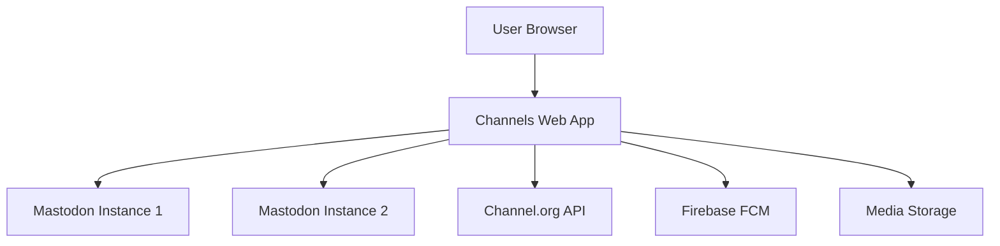
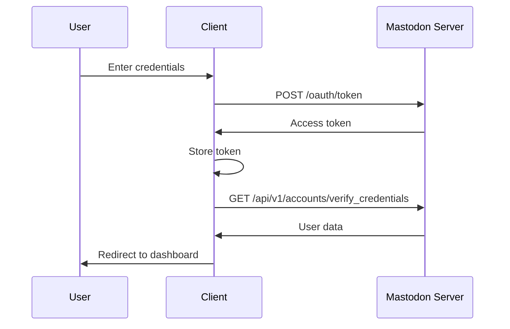
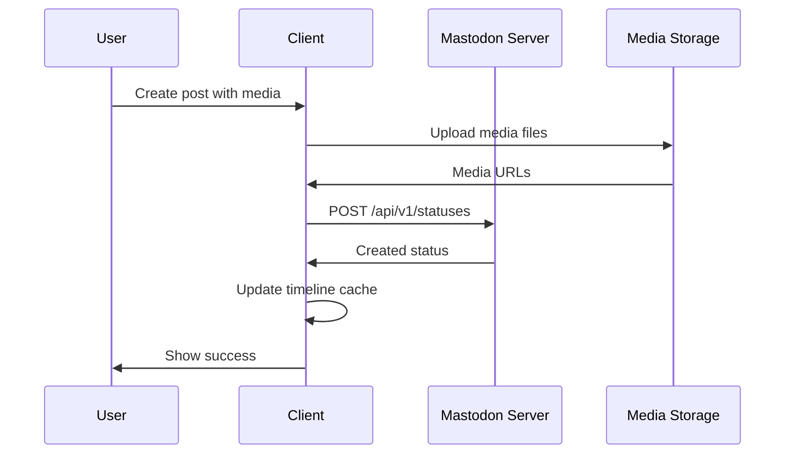
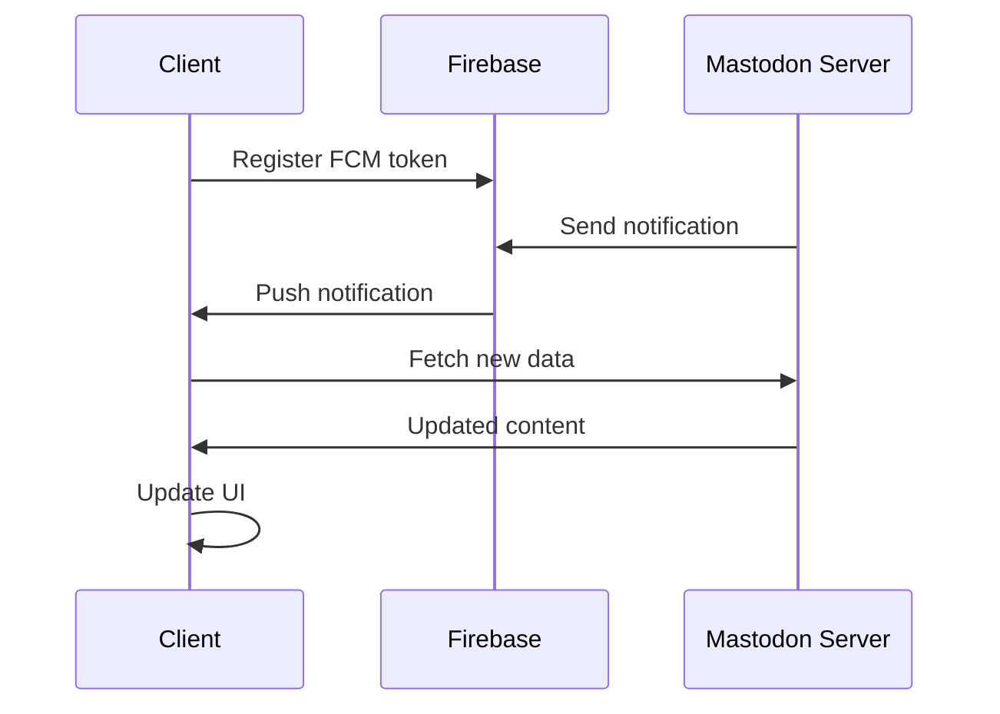

# Architecture Overview

This document provides a comprehensive overview of the Channels application architecture, design patterns, and technical decisions.

## 📋 Table of Contents

- [System Overview](#system-overview)
- [Technology Stack](#technology-stack)
- [Project Structure](#project-structure)
- [Design Patterns](#design-patterns)
- [Data Flow](#data-flow)
- [State Management](#state-management)
- [Authentication & Security](#authentication--security)
- [Performance Optimizations](#performance-optimizations)
- [Deployment Architecture](#deployment-architecture)

## 🏗️ System Overview

Channels is a modern web application built as a client for Mastodon-compatible social media servers. It follows a client-server architecture where the frontend communicates with various Mastodon instances through their REST APIs.



### Key Components

- **Frontend**: Next.js React application with TypeScript
- **Backend Integration**: RESTful API clients for Mastodon servers
- **Authentication**: OAuth 2.0 with multiple Mastodon instances
- **Real-time**: Firebase Cloud Messaging for push notifications
- **Storage**: Browser localStorage and server-side media storage

## 🛠️ Technology Stack

### Frontend Framework
- **Next.js 15.3.0**: App Router for file-based routing and server components
- **React 19.0.0**: Component-based UI library with hooks
- **TypeScript 5.8.2**: Static type checking and enhanced developer experience

### UI & Styling
- **Tailwind CSS 4.0.9**: Utility-first CSS framework
- **Radix UI**: Accessible, unstyled UI primitives
- **Framer Motion**: Animation library for smooth interactions
- **Lucide React**: Consistent icon library

### State Management
- **TanStack Query**: Server state management with caching
- **Zustand**: Lightweight global state management
- **React Hook Form**: Form state and validation

### Development Tools
- **Vitest**: Unit testing framework
- **ESLint**: Code linting and style enforcement
- **Turbopack**: Fast bundler for development

## 📁 Project Structure

The project follows a feature-based organization with clear separation of concerns:

```
src/
├── app/                    # Next.js App Router (Route handlers)
│   ├── [acct]/            # Dynamic user routes
│   ├── auth/              # Authentication pages
│   ├── api/               # API route handlers
│   └── globals.css        # Global styles
├── components/            # React components (Atomic Design)
│   ├── atoms/             # Basic UI elements
│   ├── molecules/         # Composite components
│   ├── organisms/         # Complex feature components
│   ├── pages/             # Page-level components
│   └── template/          # Layout templates
├── hooks/                 # Custom React hooks
│   ├── auth/              # Authentication hooks
│   ├── mutations/         # Data mutation hooks
│   ├── queries/           # Data fetching hooks
│   └── scroll/            # Scroll management hooks
├── services/              # API service layer
│   ├── auth/              # Authentication services
│   ├── profile/           # User profile services
│   ├── status/            # Post/status services
│   └── ...                # Feature-specific services
├── store/                 # Global state stores
├── types/                 # TypeScript definitions
├── utils/                 # Utility functions
└── constants/             # Application constants
```

### Atomic Design System

We implement Brad Frost's Atomic Design methodology:

**Atoms** (`components/atoms/`)
- Basic HTML elements (Button, Input, Avatar)
- No business logic, purely presentational
- Highly reusable across the application

**Molecules** (`components/molecules/`)
- Groups of atoms working together (SearchBox, UserCard)
- Simple business logic and interactions
- Reusable within specific contexts

**Organisms** (`components/organisms/`)
- Complex components with significant functionality
- Compose molecules and atoms
- Feature-specific (ComposeForm, StatusCard, ProfileHeader)

**Pages** (`components/pages/`)
- Top-level page components
- Compose organisms for complete page layouts
- Handle page-specific state and data fetching

## 🎨 Design Patterns

### 1. Custom Hooks Pattern

We extract component logic into custom hooks for reusability and testing:

```typescript
// hooks/auth/useSignIn.tsx
export const useSignIn = () => {
  const { mutateAsync, isPending, error } = useMutation({
    mutationFn: signIn,
    onSuccess: (data) => {
      setToken(data.access_token);
      router.push('/home');
    }
  });

  return { signIn: mutateAsync, loading: isPending, error };
};
```

### 2. Service Layer Pattern

API calls are abstracted into service functions:

```typescript
// services/auth/signin.ts
export const signIn = async ({ username, password }: SignInFormType) => {
  const body = {
    username,
    password,
    grant_type: "password",
    client_id: process.env.NEXT_PUBLIC_CLIENT_ID,
    client_secret: process.env.NEXT_PUBLIC_CLIENT_SECRET,
    scope: "read write follow push"
  };
  
  const { data } = await axiosInstance.post("/oauth/token", body);
  return data;
};
```

### 3. Compound Component Pattern

Complex components use the compound pattern for flexibility:

```typescript
// ComposeForm with sub-components
<ComposeForm>
  <ComposeForm.Editor />
  <ComposeForm.MediaUpload />
  <ComposeForm.PollOptions />
  <ComposeForm.Actions />
</ComposeForm>
```

### 4. Provider Pattern

Context providers manage global state and configuration:

```typescript
// Theme, Modal, FCM providers wrap the app
<ThemeProvider>
  <ModalProvider>
    <FCMProvider>
      {children}
    </FCMProvider>
  </ModalProvider>
</ThemeProvider>
```

## 🔄 Data Flow

### 1. Authentication Flow



### 2. Post Creation Flow



### 3. Real-time Updates



## 🗄️ State Management

### 1. Server State (TanStack Query)

Handles all server-side data with automatic caching, background updates, and optimistic updates:

```typescript
// Automatic caching and background refetching
const { data: timeline, isLoading } = useTimelineQuery();

// Optimistic updates for better UX
const { mutate: createPost } = useCreatePostMutation({
  onMutate: async (newPost) => {
    // Cancel outgoing refetches
    await queryClient.cancelQueries(['timeline']);
    
    // Snapshot previous value
    const previousTimeline = queryClient.getQueryData(['timeline']);
    
    // Optimistically update
    queryClient.setQueryData(['timeline'], (old) => [newPost, ...old]);
    
    return { previousTimeline };
  },
  onError: (err, newPost, context) => {
    // Rollback on error
    queryClient.setQueryData(['timeline'], context.previousTimeline);
  },
  onSettled: () => {
    // Always refetch after error or success
    queryClient.invalidateQueries(['timeline']);
  },
});
```

### 2. Global Client State (Zustand)

Manages UI state, user preferences, and cross-component communication:

```typescript
// store/auth/authStore.ts
interface AuthStore {
  token: string | null;
  userInfo: Account | null;
  setToken: (token: string | null) => void;
  setUserInfo: (user: Account | null) => void;
  logout: () => void;
}

export const useAuthStore = create<AuthStore>((set) => ({
  token: null,
  userInfo: null,
  setToken: (token) => set({ token }),
  setUserInfo: (userInfo) => set({ userInfo }),
  logout: () => set({ token: null, userInfo: null }),
}));
```

### 3. Form State (React Hook Form)

Handles form validation, submission, and error states:

```typescript
const form = useForm<ComposeFormData>({
  resolver: zodResolver(composeSchema),
  defaultValues: {
    content: '',
    visibility: 'public',
    sensitive: false,
  },
});

const onSubmit = async (data: ComposeFormData) => {
  try {
    await createPost(data);
    form.reset();
  } catch (error) {
    form.setError('root', { message: 'Failed to create post' });
  }
};
```

## 🔐 Authentication & Security

### OAuth 2.0 Flow

1. **Instance Discovery**: User enters their Mastodon server URL
2. **App Registration**: Register app with the server to get client credentials
3. **Authorization**: Redirect user to server's authorization page
4. **Token Exchange**: Exchange authorization code for access token
5. **Token Storage**: Securely store token in httpOnly cookies (in production)

### Security Measures

- **HTTPS Only**: All communication encrypted in transit
- **Token Security**: Access tokens stored securely, never in localStorage in production
- **CSRF Protection**: Next.js built-in CSRF protection
- **Content Security Policy**: Strict CSP headers to prevent XSS
- **Input Validation**: All user inputs validated on client and server
- **Rate Limiting**: Implement rate limiting for API calls

### Multi-Instance Support

The app can connect to any Mastodon-compatible server:

```typescript
// Dynamic API base URL based on user's instance
const apiClient = axios.create({
  baseURL: `https://${userInstance}`,
  headers: {
    'Authorization': `Bearer ${accessToken}`,
    'Content-Type': 'application/json',
  },
});
```

## ⚡ Performance Optimizations

### 1. Code Splitting

- **Route-based**: Automatic code splitting at page level
- **Component-based**: Dynamic imports for heavy components
- **Library splitting**: Separate vendor bundles

```typescript
// Lazy load heavy components
const ComposeModal = dynamic(() => import('./ComposeModal'), {
  loading: () => <ComposeModalSkeleton />,
});
```

### 2. Image Optimization

- **Next.js Image**: Automatic WebP conversion and responsive images
- **Lazy Loading**: Images load as they enter viewport
- **Blur Placeholders**: LQIP (Low Quality Image Placeholders)

```typescript
<Image
  src={avatar}
  alt="User avatar"
  width={48}
  height={48}
  placeholder="blur"
  blurDataURL="data:image/jpeg;base64,..."
/>
```

### 3. Caching Strategy

- **React Query**: Intelligent server state caching
- **Service Worker**: Cache static assets and API responses
- **CDN**: Static assets served from CDN

### 4. Bundle Optimization

- **Tree Shaking**: Remove unused code
- **Module Federation**: Share common dependencies
- **Compression**: Gzip/Brotli compression

## 🚀 Deployment Architecture

### Container Strategy

```dockerfile
# Multi-stage build for minimal production image
FROM node:22-alpine AS builder
WORKDIR /app
COPY . .
RUN yarn install --frozen-lockfile
RUN yarn build

FROM node:22-alpine AS runner
WORKDIR /app
ENV NODE_ENV production
COPY --from=builder /app/.next/standalone ./
EXPOSE 3000
CMD ["node", "server.js"]
```

### Environment Configuration

```bash
# Production environment variables
NODE_ENV=production
NEXT_PUBLIC_API_URL=https://api.channel.org
NEXT_PUBLIC_CLIENT_ID=your_client_id
NEXT_PUBLIC_CLIENT_SECRET=your_client_secret
NEXT_TELEMETRY_DISABLED=1
```

### Scalability Considerations

- **Horizontal Scaling**: Stateless application design allows for multiple instances
- **CDN Integration**: Static assets served from global CDN
- **Database Connection Pooling**: Efficient database connections
- **Caching Layers**: Redis for session storage and API response caching

## 🔍 Monitoring & Observability

### Error Tracking
- **Sentry**: Real-time error tracking and performance monitoring
- **Custom Error Boundaries**: Graceful error handling in React

### Analytics
- **Privacy-focused**: No personal data collection
- **Performance Metrics**: Core Web Vitals tracking
- **User Experience**: Conversion funnel analysis

### Logging
- **Structured Logging**: JSON-formatted logs for better parsing
- **Log Levels**: Different levels for development and production
- **Centralized Logging**: Aggregated logs for easier debugging

## 🔄 Future Architecture Considerations

### Potential Improvements

1. **Server-Side Rendering**: Implement SSR for better SEO and initial load times
2. **Progressive Web App**: Enhanced PWA features for mobile experience
3. **Micro-frontends**: Split large features into independent deployable units
4. **GraphQL**: Consider GraphQL for more efficient data fetching
5. **Edge Computing**: Deploy to edge locations for better performance

### Scalability Planning

1. **Database Sharding**: Horizontal database scaling strategy
2. **Caching Strategy**: Multi-layer caching (CDN, Redis, Application)
3. **Load Balancing**: Distribute traffic across multiple instances
4. **Auto-scaling**: Automatic scaling based on traffic patterns

---

This architecture document is a living document that evolves with the application. For questions or suggestions, please open an issue or discussion on GitHub.
